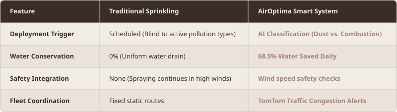
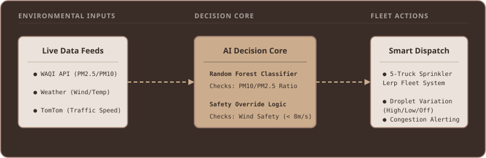
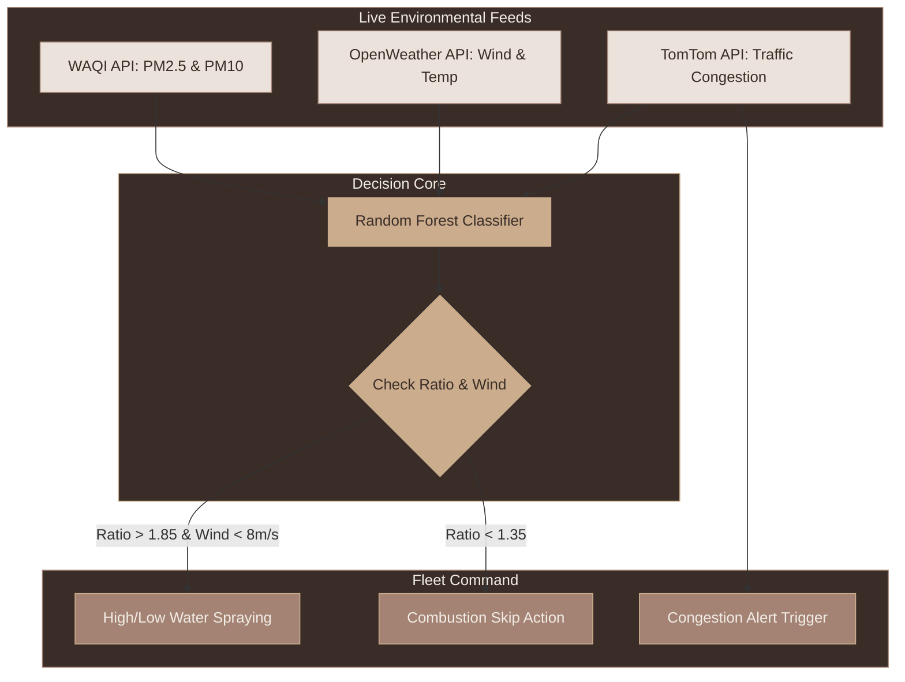
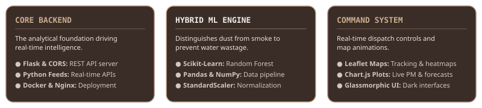
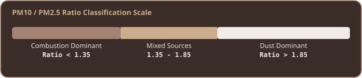

# AirOptima v3: AI-Driven Smart Sprinkling System for Delhi-NCR
### Winning Project – EPAM Climate Data Hackathon, Delhi 2026 | Awarded ₹1,00,000 Cash Prize (~USD 1060)

<!-- VISUAL 1: ANIMATED BANNER (SVG) -->
<div align="center">
  
</div>

---

## ◈ Air Pollution Challenge

Mitigating air pollution in a metropolitan city like Delhi is not a matter of simply "spraying water." uniform deployments lead to massive inefficiencies and dry reservoirs:

* **The Gaseous vs. Coarse Particle Dilemma**: Water spraying binds heavy dust (**PM10**), forcing it to settle. However, spraying combustion-dominant pollutants (**PM2.5** like vehicular exhaust or smoke) is virtually ineffective, resulting in water wastage in critical times.
* **Blind Logistics**: Deploying municipal tankers uniformly across multiple locations fails to prioritize the zones with critical needs and high human exposure.
* **Massive Resource Drain**: Uniform distribution wastes up to **68%** of municipal water resources while failing to lower PM density in combustion-heavy sectors.

---

## ◈ The Solution: AirOptima

**AirOptima** introduces an AI-driven, selective mitigation paradigm. By combining a **Hybrid Machine Learning Engine** with live GIS mapping and fleet routing simulators, it ensures that water is sprayed only when and where it is meteorologically and chemically effective.

<!-- THE SOLUTION COMPARISON TABLE (SVG) -->
<div align="center" style="margin: 20px 0;">
  
</div>

---

## ◈ System Data Flow & Pipeline

The system fetches live weather, traffic, and particulate density coordinates. It runs the data through a Random Forest Classifier to route action triggers to the water tanker fleet.

<!-- VISUAL 2: FLOW CHART (SVG) -->
<div align="center">
  
</div>

### Pipeline Workflow Schematic



---

## ◈ Tech Stack & Architecture

<!-- VISUAL 3: TECH MATRIX (HTML GRID) -->
<!-- TECH MATRIX GRIDS (SVG) -->
<div align="center" style="margin-top: 15px;">
  
</div>

---

## ◈ Classification & ML Engine

The Random Forest model determines the chemical composition of particulate matter using the PM10 vs. PM2.5 ratio boundary scale:

<!-- VISUAL 4: RATIO SCALE (SVG) -->
<div align="center" style="margin: 15px 0;">
  
</div>

* **Combustion Dominant (Ratio < 1.35)**: Primarily vehicular exhaust, crop fires, and smoke. Sprinklers are **skipped** here because water droplets do not affect these fine particles.
* **Mixed Sources (Ratio 1.35 – 1.85)**: Combined particles. Prevents high concentration by utilizing a **preventive low-intensity spray**.
* **Dust Dominant (Ratio > 1.85)**: Heavy construction dust and sand. Triggers a **high-intensity water spray** to suppress the settling process.

---

## ◈ Getting Started

### Prerequisites

* Python 3.9+
* Active API keys for the following endpoints:
  * **WAQI API** (Air Quality Index mapping)
  * **OpenWeatherMap API** (Wind speed safety validation)
  * **TomTom API** (Traffic speed indices)

### 1. Installation

Clone the repository and install the backend modules:
```bash
git clone https://github.com/your-repo/airoptima.git
cd airoptima
pip install flask flask-cors numpy pandas scikit-learn requests python-dotenv
```

### 2. Configure Environment

Create a `.env` file in the root workspace folder:
```env
OPENWEATHER_KEY=your_openweather_key_here
TOMTOM_KEY=your_tomtom_key_here
WAQI_KEY=your_waqi_key_here
```

### 3. Run the Backend

Launch the multi-threaded Flask server:
```bash
python app.py
```
*The backend automatically trains the Random Forest classifier model and hosts endpoints on `http://localhost:5000`.*

### 4. Open the Command Center

Simply open `index.html` in your web browser. The dashboard automatically syncs with the live API server.

---

## ◈ Future Milestones

* **RAG Integration**: Developing Retrieval-Augmented Generation vectors to query municipal mitigation history via natural language prompts (e.g. *"Which sectors saved the most water last month?"*).
* **Adaptive Re-training**: Enabling online learning patterns to automatically adjust class boundaries during seasonal winter smog transitions.

---

<!-- FOOTER (SVG) -->
<div align="center" style="margin-top: 50px;">
  <a href="https://www.linkedin.com/in/ivysingh99/" target="_blank">
    
  </a>
</div>