# AirOptima v3: AI-Driven Smart Sprinkling System for Delhi-NCR
### 🏆 Winning Project – EPAM Climate Data Hackathon, Delhi 2026 | Awarded ₹1,00,000 Cash Prize (~USD 1060)

<!-- VISUAL 1: ANIMATED BANNER (SVG) -->
<div align="center">
  
</div>

---

## ◈ The Air Quality Paradox

Mitigating air pollution in a metropolitan city like Delhi is not a matter of simply "spraying water." uniform deployments lead to massive inefficiencies and dry reservoirs:

* ** The Gaseous vs. Coarse Particle Dilemma**: Water spraying binds heavy dust (**PM10**), forcing it to settle. However, spraying combustion-dominant pollutants (**PM2.5** like vehicular exhaust or smoke) is virtually ineffective, resulting in water wastage in critical times.
* ** Blind Logistics**: Deploying municipal tankers uniformly across multiple locations fails to prioritize the zones with critical needs and high human exposure.
* ** Massive Resource Drain**: Uniform distribution wastes up to **68%** of municipal water resources while failing to lower PM density in combustion-heavy sectors.

---

## ◈ The Solution: AirOptima

**AirOptima** introduces an AI-driven, selective mitigation paradigm. By combining a **Hybrid Machine Learning Engine** with live GIS mapping and fleet routing simulators, it ensures that water is sprayed only when and where it is meteorologically and chemically effective.

<div align="center" style="margin: 20px 0;">
  <table style="width: 100%; border-collapse: collapse; border-spacing: 0; font-family: 'Segoe UI', sans-serif; font-size: 13px;">
    <thead>
      <tr style="background-color: #3A2D28; color: #F1EDE6; border-bottom: 2px solid #CBAD8D;">
        <th style="padding: 12px; text-align: left; border-right: 1px solid #D1C7BD;">Feature</th>
        <th style="padding: 12px; text-align: left; border-right: 1px solid #D1C7BD;">Traditional Sprinkling</th>
        <th style="padding: 12px; text-align: left;">AirOptima Smart System</th>
      </tr>
    </thead>
    <tbody>
      <tr style="background-color: #F1EDE6; color: #3A2D28; border-bottom: 1px solid #D1C7BD;">
        <td style="padding: 12px; font-weight: bold; border-right: 1px solid #D1C7BD;">Deployment Trigger</td>
        <td style="padding: 12px; border-right: 1px solid #D1C7BD;">Scheduled (Blind to active pollution types)</td>
        <td style="padding: 12px; font-weight: bold; color: #A48374;">AI Classification (Dust vs. Combustion)</td>
      </tr>
      <tr style="background-color: #EBE3DB; color: #3A2D28; border-bottom: 1px solid #D1C7BD;">
        <td style="padding: 12px; font-weight: bold; border-right: 1px solid #D1C7BD;">Water Conservation</td>
        <td style="padding: 12px; border-right: 1px solid #D1C7BD;">0% (Uniform water drain)</td>
        <td style="padding: 12px; font-weight: bold; color: #A48374;">68.5% Water Saved Daily</td>
      </tr>
      <tr style="background-color: #F1EDE6; color: #3A2D28; border-bottom: 1px solid #D1C7BD;">
        <td style="padding: 12px; font-weight: bold; border-right: 1px solid #D1C7BD;">Safety Integration</td>
        <td style="padding: 12px; border-right: 1px solid #D1C7BD;">None (Spraying continues in high winds)</td>
        <td style="padding: 12px; font-weight: bold; color: #A48374;">Wind speed &amp; Direction checks</td>
      </tr>
      <tr style="background-color: #EBE3DB; color: #3A2D28;">
        <td style="padding: 12px; font-weight: bold; border-right: 1px solid #D1C7BD;">Fleet Coordination</td>
        <td style="padding: 12px; border-right: 1px solid #D1C7BD;">Fixed static routes</td>
        <td style="padding: 12px; font-weight: bold; color: #A48374;">Dynamic TomTom Traffic Routing</td>
      </tr>
    </tbody>
  </table>
</div>

---

## ◈ System Data Flow & Pipeline

The system fetches live weather, traffic, and particulate density coordinates. It runs the data through a Random Forest Classifier to route action triggers to the water tanker fleet.

<!-- VISUAL 2: FLOW CHART (SVG) -->
<div align="center">
  
</div>

---

## ◈ Tech Stack & Architecture

AirOptima is architected as a modular, responsive full-stack system designed to handle real-time geospatial data.

<!-- VISUAL 3: TECH MATRIX (HTML GRID) -->
<div align="center" style="margin-top: 15px;">
  <table style="width: 100%; border-spacing: 12px; border-collapse: separate; background: transparent; font-family: 'Segoe UI', system-ui, sans-serif;">
    <tr>
      <!-- Column 1: Core System -->
      <td width="33.3%" style="background-color: #3A2D28; border: 1.5px solid #A48374; border-radius: 12px; padding: 20px; vertical-align: top; color: #F1EDE6; box-shadow: 0 4px 12px rgba(58,45,40,0.15);">
        <h3 style="margin-top: 0; color: #CBAD8D; border-bottom: 1.5px solid #A48374; padding-bottom: 8px; font-family: 'JetBrains Mono', monospace; font-size: 14px;">🎛️ CORE BACKEND</h3>
        <p style="font-size: 12.5px; line-height: 1.6; color: #EBE3DB;">The analytical foundation driving real-time intelligence.</p>
        <ul style="padding-left: 18px; margin: 0; font-size: 12px; color: #D1C7BD; line-height: 1.8;">
          <li><b>Flask &amp; CORS:</b> Multi-threaded REST API server.</li>
          <li><b>Python Live Feeds:</b> Connects to real-time APIs.</li>
          <li><b>Dotenv Config:</b> Secure local credential management.</li>
        </ul>
      </td>
      <!-- Column 2: Decision Engine -->
      <td width="33.3%" style="background-color: #3A2D28; border: 1.5px solid #CBAD8D; border-radius: 12px; padding: 20px; vertical-align: top; color: #F1EDE6; box-shadow: 0 4px 12px rgba(58,45,40,0.15);">
        <h3 style="margin-top: 0; color: #F1EDE6; border-bottom: 1.5px solid #CBAD8D; padding-bottom: 8px; font-family: 'JetBrains Mono', monospace; font-size: 14px;"> HYBRID ML ENGINE</h3>
        <p style="font-size: 12.5px; line-height: 1.6; color: #EBE3DB;">Distinguishes dust from smoke to prevent water wastage.</p>
        <ul style="padding-left: 18px; margin: 0; font-size: 12px; color: #D1C7BD; line-height: 1.8;">
          <li><b>Scikit-Learn:</b> Random Forest Classifier model.</li>
          <li><b>Pandas &amp; NumPy:</b> Data processing pipelines.</li>
          <li><b>StandardScaler:</b> Feature normalization.</li>
        </ul>
      </td>
      <!-- Column 3: Dashboard & GIS -->
      <td width="33.3%" style="background-color: #3A2D28; border: 1.5px solid #A48374; border-radius: 12px; padding: 20px; vertical-align: top; color: #F1EDE6; box-shadow: 0 4px 12px rgba(58,45,40,0.15);">
        <h3 style="margin-top: 0; color: #CBAD8D; border-bottom: 1.5px solid #A48374; padding-bottom: 8px; font-family: 'JetBrains Mono', monospace; font-size: 14px;"> COMMAND SYSTEM</h3>
        <p style="font-size: 12.5px; line-height: 1.6; color: #EBE3DB;">Real-time dispatch controls and map animations.</p>
        <ul style="padding-left: 18px; margin: 0; font-size: 12px; color: #D1C7BD; line-height: 1.8;">
          <li><b>Leaflet Maps:</b> Live truck tracking &amp; heatmaps.</li>
          <li><b>Chart.js Plots:</b> PM2.5/PM10 ratio &amp; AQI forecasts.</li>
          <li><b>Glassmorphic UI:</b> Neon-highlighted dark interfaces.</li>
        </ul>
      </td>
    </tr>
  </table>
</div>

---

## ◈ Classification & ML Engine

The Random Forest model determines the chemical composition of particulate matter using the PM10 vs. PM2.5 ratio boundary scale:

<!-- VISUAL 4: RATIO SCALE (SVG) -->
<div align="center" style="margin: 15px 0;">
  
</div>

* ** Combustion Dominant (Ratio < 1.35)**: Primarily vehicular exhaust, crop fires, and smoke. Sprinklers are **skipped** here because water droplets do not affect these fine particles.
* ** Mixed Sources (Ratio 1.35 – 1.85)**: Combined particles. Prevents high concentration by utilizing a **preventive low-intensity spray**.
* ** Dust Dominant (Ratio > 1.85)**: Heavy construction dust and sand. Triggers a **high-intensity water spray** to suppress the settling process.

---

## ◈ Simulated Water & Cost Efficiencies

By actively skipping combustion-dominant zones and adapting pressure thresholds based on wind conditions, AirOptima achieves major resource optimizations.

<!-- VISUAL 5: PERFORMANCE CHART (SVG) -->
<div align="center" style="margin: 15px 0;">
  
</div>

---

## ◈ Getting Started

Follow these steps to deploy and run the AirOptima command dashboard locally.

### Prerequisites

* Python 3.9+
* Active API keys for the following endpoints:
  * **WAQI API** (Air Quality Index mapping)
  * **OpenWeatherMap API** (Wind speed safety validation)
  * **TomTom API** (Traffic speed indices)

### 1. Installation

Clone the repository and install the backend modules:
```bash
git clone https://github.com/your-repo/airoptima.git
cd airoptima
pip install flask flask-cors numpy pandas scikit-learn requests python-dotenv
```

### 2. Configure Environment

Create a `.env` file in the root workspace folder:
```env
OPENWEATHER_KEY=your_openweather_key_here
TOMTOM_KEY=your_tomtom_key_here
WAQI_KEY=your_waqi_key_here
```

### 3. Run the Backend

Launch the multi-threaded Flask server:
```bash
python app.py
```
*The backend automatically trains the Random Forest classifier model and hosts endpoints on `http://localhost:5000`.*

### 4. Open the Command Center

Simply open `index.html` in your web browser. The dashboard automatically syncs with the live API server.

---

## ◈ Future Milestones

* ** RAG Integration**: Developing Retrieval-Augmented Generation vectors to query municipal mitigation history via natural language prompts (e.g. *"Which sectors saved the most water last month?"*).
* ** Adaptive Re-training**: Enabling online learning patterns to automatically adjust class boundaries during seasonal winter smog transitions.

---

<div align="center" style="margin-top: 50px; padding: 25px; background: #3A2D28; border-radius: 12px; border: 1.5px solid #CBAD8D; font-family: 'Segoe UI', sans-serif; color: #F1EDE6;">
  <p style="font-size: 15px; font-weight: bold; margin-top: 0; color: #CBAD8D;">Thank you for exploring this project.</p>
  <p style="font-size: 12px; color: #EBE3DB; margin-bottom: 20px;">⭐ If you found value in it, consider starring the repository.</p>
  
  <div style="width: 60px; height: 1.5px; background: #A48374; margin: 15px auto;"></div>
  
  <p style="font-size: 13px; font-weight: bold; margin-bottom: 5px;">Developed by Ivy Singh</p>
  <p style="font-size: 12px; margin-bottom: 12px; font-family: 'JetBrains Mono', monospace;"><a href="mailto:ivysingh99@gmail.com" style="color: #CBAD8D; text-decoration: none;">ivysingh99@gmail.com</a></p>
  
  <a href="https://www.linkedin.com/in/ivysingh99/" target="_blank" style="display: inline-flex; align-items: center; gap: 8px; padding: 6px 16px; background: #A48374; color: #F1EDE6; text-decoration: none; border-radius: 6px; font-size: 12px; font-weight: bold; transition: background 0.3s;">
    🔗 LinkedIn
  </a>
</div>